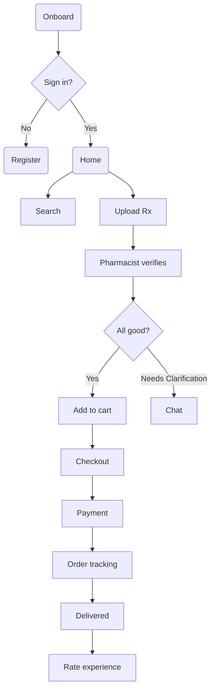

Below is a complete, end-to-end concept for a modern E-Pharmacy mobile app—“Medio”—including design principles, IA, component library, and low-fidelity wireframes (ASCII + Mermaid) that you can quickly translate into Figma, Sketch, or Adobe XD.

────────────────────────

1. Brand & Experience Pillars
   ────────────────────────

- Trust first: HIPAA/GDPR compliant, pharmacy-grade security cues
- 3-tap fulfillment: search → verify → checkout ≤ 3 taps
- Human-in-the-loop: Live chat/video with pharmacists 24 × 7
- Predictive care: AI-driven refills, interaction alerts, vitals log
- Inclusive by design: WCAG 2.2 AA, dynamic font/contrast toggle

──────────────────────── 2. Primary User Personas
────────────────────────

- Caregiver “Asha”, 38, buys meds for parents & kids
- Chronic-care “Ravi”, 52, monthly cardiac & diabetes refills
- Gen-Z “Neha”, 24, acute/self-care, price-sensitive

──────────────────────── 3. Information Architecture (IA)
────────────────────────
Bottom tab bar (5): Home, Search, Orders, Care, Profile

Home

- Smart-card stack: Refill due, Active Rx, Deals, Health tips
- Quick upload (camera)

Search

- Pill-shaped field + voice input
- Two scopes: Medicine | Wellness
- Filters: Generic/brand, delivery speed, substitutes

Orders

- Current | Past | Subscriptions
- Live tracking card → Map view

Care

- Chat | Call | Video consult
- Drug interaction checker
- Health journals & vitals log

Profile

- Dependents list
- E-wallet & insurance
- Settings (accessibility, reminders)

──────────────────────── 4. Design System Snapshot
────────────────────────
Color

- Primary : #0066FF (accessible blue, trust)
- Secondary: #5DDB96 (wellness green)
- Critical : #FF5252 (interaction alerts)
- Surface : #FFFFFF / #F6F8FB
  Typography (Google Inter)
- H1 : 24 pt, 700
- H2 : 18 pt, 600
- Body: 14 pt, 400
  Corner radius
- Card 12 dp, button 24 dp (pill shape)
  Elevation
- Floating card 4 dp, modal 16 dp

Core components

- Smart-Card (status, CTA)
- PillButton (primary/secondary/destructive)
- MedTile (image, name, strength, price, add-to-cart)
- TimelineStepper (order tracking)
- UploadDrop (drag/cam snap)
- AlertBanner (interaction/warning)

──────────────────────── 5. Low-Fidelity Wireframes
────────────────────────

Home (tab 1) – ASCII

```
+----------------------------------------------------+
|    Good evening, Asha          🔔   🛒(2)          |
|----------------------------------------------------|
| 📷  Upload Rx                                       |
|----------------------------------------------------|
| ⏰  Refill due tomorrow (Rosuvastatin)   Refill➡    |
|----------------------------------------------------|
| 💊  Active prescriptions                            |
|    |Rosu..|Metf..|Amlod..| +2 |                    |
|----------------------------------------------------|
| 💸  Deal of the day  -20 % on vitamin combos       |
|----------------------------------------------------|
| 🩺  Quick tips: "Monitor BP daily"                 |
+----------------------------------------------------+
TabBar:  🏠  🔎  📦  ❤️  👤
```

Search Results – ASCII

```
Search: [ Rosu... ][Voice🎤]
Filters Σ
------------------------------------------------------
| Img | Rosuvastatin 10 mg              ₹199  Add➕ |
| Img | Rozavel (Substitute)            ₹149  Add➕ |
| Img | Crestor 10 mg                   ₹240  Add➕ |
------------------------------------------------------
Sub-nav: Details | Reviews | Alt brands | Interaction
```

Order Tracking – ASCII

```
Order #4781 • ETA Today 6-8 pm
------------------------------------------------------
Placed✅ ---- Packed✅ ---- OutForDelivery🟡 ---- Done
Courier: Rajesh  📞Call  📍Map
```

Care (tab 4) – ASCII

```
Need help?    |⌘|  Search interactions
------------------------------------------------------
Chat with pharmacist → Avg reply 2 min
Book video consult  📹  ₹299
Check drug interaction  💊➗
Your vitals log  ❤️
```

Profile – ASCII

```
Asha Gupta  ✎
------------------------------------------------------
Dependents  ➡
Payment & Insurance ➡
Accessibility & Reminders ➡
Order preferences ➡
Log-out
```

Mermaid user flow (pseudocode)



──────────────────────── 6. Accessibility & Micro-UX
────────────────────────

- Motion-reduced variant: minimal Lottie, no parallax
- VoiceOver/TalkBack: logical order, explicit labels
- Haptic tap on critical actions (Add, Pay)
- Empty-state illustrations with single CTA
- Error prevention: drug interaction banner blocks checkout
- 3-second undo snackbar for cart deletions

──────────────────────── 7. Delight & Retention Hooks
────────────────────────

- “Streak refill” gamification: 5 on-time refills → ₹100 cashback
- Personalized health digest every Sunday (opt-in)
- NFC-powered pill bottle sync (future hardware tie-in)

──────────────────────── 8. Handoff Tips
────────────────────────

- Create a Figma frame 390 × 844 (iPhone 14) per screen above
- Use Auto-layout + components for Smart-Card & PillButton
- Export color & type tokens to JSON → integrate with Tailwind

Use the above blueprint as a starting point, refine visuals, and you will have a unique, user-centric E-Pharmacy app ready for prototyping and user testing.
